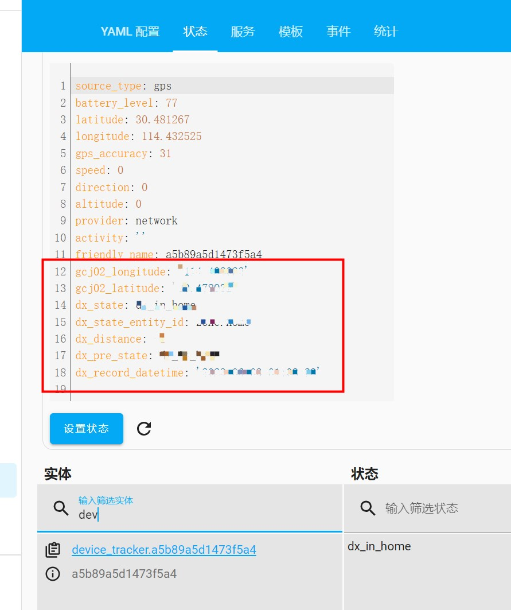

<!--
 * @Author        : dx
 * @Github        : https://github.com/d380025303
 * @Description   : 
 * @Date          : 2023-05-29 16:00:00
 * @LastEditors   : dx
 * @LastEditTime  : 2023-05-29 16:00:00
 -->

# Dx Gaode Map Card

[](https://github.com/hacs/integration)

基于高德地图API实现的Home Assistant前端卡片

+ 支持修改地点位置，修改地点范围（你将不用烦恼GPS与国内经纬度偏差）
+ 支持GPSLogger实时展示

## 更新
+ v1.0
  + 支持修改地点位置，修改地点范围（你将不用烦恼GPS与国内经纬度偏差）
  + 支持GPSLogger实时展示
+ v2.0(重大更新) -- 必须与 [ha_gaode_server](https://github.com/d380025303/ha_gaode_server) 一起食用
  + 增加GPS路径轨迹
  + 增加GPS与zone的交互事件
  + 修复bug: 重启后位置点被重置
 
**tips: 需要用单卡片模式, 也就是说仪表盘只能是本卡片, 不然显示效果不全!**

## 预览

### 修改地点位置，范围
tip: 编辑后经纬度可直接点击地图设置


### GPSLogger实时展示，zone位置展示


### 当GPSLogger上报后, 如果进入"我的家"范围, 唤起小爱同学播放: "我回来啦" 


### 通过GPSLogger上报记录, 绘制路径轨迹


更多玩法, 欢迎想象~

# 安装
## HACS 安装
1. HACS > 前端 > 浏览并下载存储库 > 搜索 ```dxgaodemapcard```，点击下载
2. 参见`手动安装`第三步及以后

## 手动安装
1. 下载 `dist\ha_gaode.js`
1. 复制到 `\config\www\ha_gaode\ha_gaode.js`
1. 添加资源 `/local/ha_gaode/ha_gaode.js`
   
1. 添加自定义卡片，使用以下配置：
    ```yaml
    type: custom:dx-gaode-map-card
    center: 
    gaode_key: 
    gaode_key_security_code: 
    ```

## 选项
tips: 高德Key，安全密钥 请前往https://console.amap.com/dev/key/app 申请

| 属性名 | 类型     | 默认     | 描述
| ---- |--------|--------| -----------
| type | string | **必填** | 卡片定义，固定写死 custom:dx-gaode-map-card 即可
| gaode_key | string | **必选** | 高德key
| gaode_key_security_code | string | **必选** | 高德安全秘钥 
| center | entity_id | 可选 | 初始化默认中心位置

## 详细说明
GPSLogger 通过 [ha_gaode_server](https://github.com/d380025303/ha_gaode_server) 获得了一些增强属性


- gcj02_longitude: 高德的经度
- gcj02_latitude: 高德的纬度
- dx_state: 设备当前状态
```text
dx_unknown: 未知(一般不会出现)
dx_in_home: "我的家"实体范围内
dx_in_zone: 在某个zone实体范围内
dx_out: 不在任何zone范围内
```
- dx_pre_state: 设备前一个状态, 状态值同 ```dx_state```
- dx_state_entity_id: 当```dx_state```为```dx_in_zone```时, zone的值
- dx_distance: 当进入范围内, 距离中心的距离, 如果不在范围内, 值为 -1
- dx_record_datetime: GPSLogger上报时间
