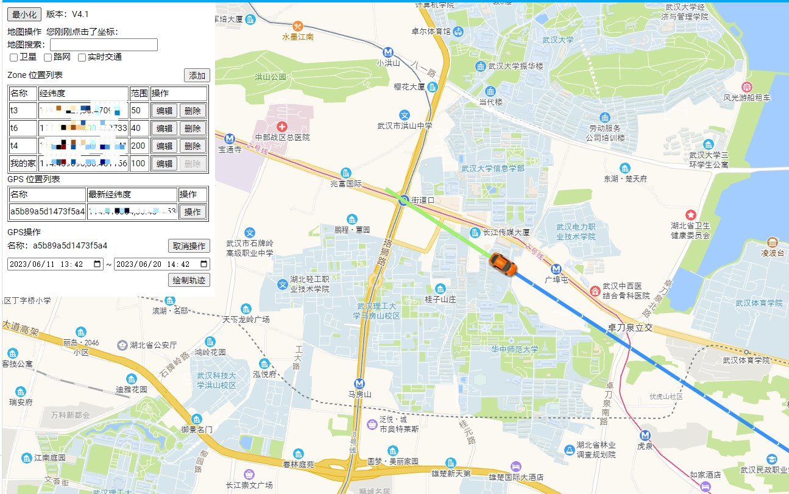

<!--
 * @Author        : dx
 * @Github        : https://github.com/d380025303
 * @Description   : 
 * @Date          : 2023-05-29 16:00:00
 * @LastEditors   : dx
 * @LastEditTime  : 2023-05-29 16:00:00
 -->

# Dx Gaode Map Card

[](https://github.com/hacs/integration)

基于高德地图API实现的Home Assistant前端卡片

+ 支持修改地点位置，修改地点范围（你将不用烦恼GPS与国内经纬度偏差）
+ 支持GPSLogger实时展示

## 更新
+ v1.0
  + 支持修改地点位置，修改地点范围（你将不用烦恼GPS与国内经纬度偏差）
  + 支持GPSLogger实时展示
+ v2.0(重大更新) -- 必须与 [ha_gaode_server](https://github.com/d380025303/ha_gaode_server) 一起食用
  + 增加GPS路径轨迹
  + 增加GPS与zone的交互事件
  + 修复bug: 重启后位置点被重置
+ v2.1
  + 增加地图位置搜索功能（高德限制每天只能搜索100次,不过应该够了)
  + 增加卫星,路网,实时交通图层展示
  + 增加点击地图会显示高德坐标功能
+ v3.0
  + 路径轨迹可以根据时间条件展现了
  + 支持可选择哪些device_tracker展示在地图上
  + 修复主题原因导致文字消失的问题
 
**tips: 需要用单卡片模式, 也就是说仪表盘只能是本卡片, 不然显示效果不全!**

## 预览

### 修改地点位置，范围
tip: 编辑后经纬度可直接点击地图设置


### GPSLogger实时展示，zone位置展示


### 当GPSLogger上报后, 如果进入"我的家"范围, 唤起小爱同学播放: "我回来啦" 


### 通过GPSLogger上报记录, 绘制路径轨迹


更多玩法, 欢迎想象~

# 安装
## HACS 安装
1. HACS > 前端 > 浏览并下载存储库 > 搜索 ```dxgaodemapcard```，点击下载
2. 参见`手动安装`第三步及以后

## 手动安装
1. 下载 `dist\ha_gaode.js`
1. 复制到 `\config\www\ha_gaode\ha_gaode.js`
1. 添加资源 `/local/ha_gaode/ha_gaode.js`
   
1. 添加自定义卡片，使用以下配置：
    ```yaml
    type: custom:dx-gaode-map-card
    gaode_key: 
    gaode_key_security_code: 
    # 以下是device_tracker_include的配置示例, 如果不需要, 不要粘贴
    device_tracker_include:
      - device_tracker.XXXX
    ```

## 选项
tips: 高德Key，安全密钥 请前往https://console.amap.com/dev/key/app 申请

| 属性名 | 类型     | 默认     | 描述
| ---- |--------|--------| -----------
| type | string | **必填** | 卡片定义，固定写死 custom:dx-gaode-map-card 即可
| gaode_key | string | **必选** | 高德key
| gaode_key_security_code | string | **必选** | 高德安全秘钥 
| center | entity_id | 可选 | 初始化默认中心位置
| default_tra_time | int | 可选 | 默认绘制路径轨迹距离现在的时间(分钟)
| device_tracker_include | list | 可选 | 哪些device_tracker展现在地图上(不配置默认全部)

